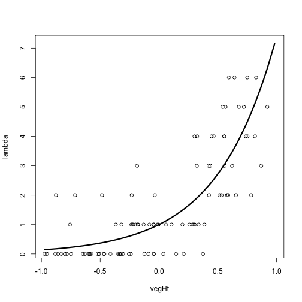
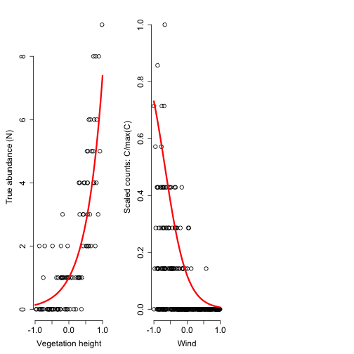

We will use the N-mixture model from Chapter 10, Section 10.4 of Applied Hierarchical Modeling as an example. 

#### Brief summary of the model

- It is a simulated example.
- `M` = 100 sites.
- `C[i, j]` is the count from visit `j` to site `i`.
- Each site has latent true abundance `N[i]`.
- Expected abundance depends on `vegHt`.
- Detection probability depends on `wind`.

The code is provided below in three sections.

# Set up model variables and make some plots.

The first section that sets up the model variables and makes some plots.  You should be able to run directly through this.

```r
## Original code from Section 6.4 for AHM

# 6.4 A slightly more complex N-mixture model with covariates
# ------------------------------------------------------------------------

# Choose sample sizes and prepare obs. data array y
set.seed(1)                   # So we all get same data set
M <- 100                      # Number of sites
J <- 3                        # Number of repeated abundance measurements
C <- matrix(NA, nrow = M, ncol = J) # to contain the observed data

# Create a covariate called vegHt
vegHt <- sort(runif(M, -1, 1)) # sort for graphical convenience

# Choose parameter values for abundance model and compute lambda
beta0 <- 0                    # Log-scale intercept
beta1 <- 2                    # Log-scale slope for vegHt
lambda <- exp(beta0 + beta1 * vegHt) # Expected abundance
plot(vegHt, lambda, type = "l", lwd = 3)  # Expected abundance

# Draw local abundance and look at data so far
N <- rpois(M, lambda)
points(vegHt, N)              # Add realized abundance to plot
```



```r
table(N)
```

```
## N
##  0  1  2  3  4  5  6  8  9 
## 35 24 12  7  9  5  4  3  1
```

```r
# Plot the true system state (Fig. left)
par(mfrow = c(1, 3), mar = c(5,5,2,2), cex.axis = 1.5, cex.lab = 1.5)
plot(vegHt, N, xlab="Vegetation height", ylab="True abundance (N)", frame = F, cex = 1.5)
lines(seq(-1,1,,100), exp(beta0 + beta1* seq(-1,1,,100)), lwd=3, col = "red")


# Create a covariate called wind
wind <- array(runif(M * J, -1, 1), dim = c(M, J))

# Choose parameter values for measurement error model and compute detectability
alpha0 <- -2                        # Logit-scale intercept
alpha1 <- -3                        # Logit-scale slope for wind
p <- plogis(alpha0 + alpha1 * wind) # Detection probability
#plot(p ~ wind, ylim = c(0,1))       # Look at relationship

# Take J = 3 abundance measurements at each site
for(j in 1:J) {
    C[,j] <- rbinom(M, N, p[,j])
}

# Plot observed data and effect of wind on det. probability (Fig. middle)
plot(wind, C/max(C), xlab="Wind", ylab="Scaled counts: C/max(C)", frame = F, cex = 1.5)
lines(seq(-1,1,,100), plogis(alpha0 + alpha1*seq(-1,1,,100)), lwd=3, col="red")


# Expected (lambda) and realized abundance (N) and measurements (C)
cbind(lambda=round(lambda,2), N=N, C1=C[,1], C2=C[,2], C3=C[,3])
```

```
##        lambda N C1 C2 C3
##   [1,]   0.14 0  0  0  0
##   [2,]   0.15 0  0  0  0
##   [3,]   0.17 0  0  0  0
##   [4,]   0.17 2  1  0  0
##   [5,]   0.18 0  0  0  0
##   [6,]   0.19 0  0  0  0
##   [7,]   0.20 0  0  0  0
##   [8,]   0.21 0  0  0  0
##   [9,]   0.22 1  1  1  1
##  [10,]   0.22 0  0  0  0
##  [11,]   0.24 2  0  1  0
##  [12,]   0.27 0  0  0  0
##  [13,]   0.29 0  0  0  0
##  [14,]   0.30 0  0  0  0
##  [15,]   0.30 0  0  0  0
##  [16,]   0.31 0  0  0  0
##  [17,]   0.32 0  0  0  0
##  [18,]   0.35 0  0  0  0
##  [19,]   0.36 0  0  0  0
##  [20,]   0.36 0  0  0  0
##  [21,]   0.38 2  1  0  1
##  [22,]   0.39 0  0  0  0
##  [23,]   0.39 0  0  0  0
##  [24,]   0.44 0  0  0  0
##  [25,]   0.48 1  0  0  0
##  [26,]   0.50 0  0  0  0
##  [27,]   0.51 0  0  0  0
##  [28,]   0.51 0  0  0  0
##  [29,]   0.53 0  0  0  0
##  [30,]   0.53 1  0  0  0
##  [31,]   0.54 0  0  0  0
##  [32,]   0.60 0  0  0  0
##  [33,]   0.62 0  0  0  0
##  [34,]   0.62 1  0  0  0
##  [35,]   0.63 2  1  2  2
##  [36,]   0.63 1  0  0  0
##  [37,]   0.64 1  0  0  0
##  [38,]   0.67 1  0  0  0
##  [39,]   0.69 3  0  0  0
##  [40,]   0.70 1  0  0  0
##  [41,]   0.70 1  1  0  1
##  [42,]   0.77 1  0  1  1
##  [43,]   0.78 0  0  0  0
##  [44,]   0.84 0  0  0  0
##  [45,]   0.85 1  0  0  0
##  [46,]   0.91 1  1  1  0
##  [47,]   0.91 0  0  0  0
##  [48,]   0.91 1  1  1  0
##  [49,]   0.92 0  0  0  0
##  [50,]   0.93 2  0  0  1
##  [51,]   0.97 1  0  0  0
##  [52,]   0.99 1  0  1  0
##  [53,]   1.08 0  0  0  0
##  [54,]   1.13 1  0  0  1
##  [55,]   1.24 1  0  0  1
##  [56,]   1.34 0  0  0  0
##  [57,]   1.49 1  0  0  0
##  [58,]   1.52 0  0  0  0
##  [59,]   1.68 1  0  0  0
##  [60,]   1.77 1  0  0  1
##  [61,]   1.80 1  0  1  1
##  [62,]   1.83 4  2  2  1
##  [63,]   1.83 1  1  0  0
##  [64,]   1.90 3  1  2  1
##  [65,]   1.91 4  0  0  1
##  [66,]   1.96 1  1  0  0
##  [67,]   2.11 0  0  0  0
##  [68,]   2.16 1  0  0  1
##  [69,]   2.33 3  0  0  0
##  [70,]   2.34 2  0  0  0
##  [71,]   2.39 3  3  1  0
##  [72,]   2.45 4  3  1  0
##  [73,]   2.53 4  0  0  0
##  [74,]   2.80 2  0  1  0
##  [75,]   2.90 2  1  2  1
##  [76,]   2.94 5  2  3  3
##  [77,]   3.03 4  3  1  0
##  [78,]   3.03 4  2  0  1
##  [79,]   3.05 3  0  3  0
##  [80,]   3.10 5  0  0  0
##  [81,]   3.18 2  2  1  0
##  [82,]   3.24 2  2  0  1
##  [83,]   3.28 6  0  0  0
##  [84,]   3.47 3  1  0  0
##  [85,]   3.61 6  3  3  0
##  [86,]   3.70 2  0  1  0
##  [87,]   3.89 5  2  0  3
##  [88,]   4.24 5  5  0  5
##  [89,]   4.29 8  3  4  0
##  [90,]   4.39 4  2  0  2
##  [91,]   4.49 6  2  2  4
##  [92,]   4.50 4  3  3  0
##  [93,]   4.80 2  0  0  0
##  [94,]   4.92 8  3  0  7
##  [95,]   5.12 4  1  3  2
##  [96,]   5.21 6  0  2  0
##  [97,]   5.69 3  3  0  0
##  [98,]   5.92 8  5  3  2
##  [99,]   6.31 5  3  1  0
## [100,]   7.15 9  0  2  6
```

```r
# Create factors
time <- matrix(rep(as.character(1:J), M), ncol = J, byrow = TRUE)
hab <- c(rep("A", 33), rep("B", 33), rep("C", 34))  # assumes M = 100

## A section of original code for creating book figures has been removed here.

# Bundle data
win.data <- list(C = C, M = nrow(C), J = ncol(C), wind = wind, vegHt = vegHt, hab = as.numeric(factor(hab)), XvegHt = seq(-1, 1,, 100), Xwind = seq(-1, 1,,100) )
str(win.data)
```

```
## List of 8
##  $ C     : int [1:100, 1:3] 0 0 0 1 0 0 0 0 1 0 ...
##  $ M     : int 100
##  $ J     : int 3
##  $ wind  : num [1:100, 1:3] -0.465 -0.5627 0.0336 -0.4621 -0.6377 ...
##  $ vegHt : num [1:100] -0.973 -0.953 -0.882 -0.876 -0.859 ...
##  $ hab   : num [1:100] 1 1 1 1 1 1 1 1 1 1 ...
##  $ XvegHt: num [1:100] -1 -0.98 -0.96 -0.939 -0.919 ...
##  $ Xwind : num [1:100] -1 -0.98 -0.96 -0.939 -0.919 ...
```



Note the last line creates the list of data values for use in BUGS/JAGS/NIMBLE model.

Some of the original book code was omitted.

# Set up model for BUGS/JAGS

This needs to be modified for use by NIMBLE.


```r
# Specify model in BUGS language
cat(file = "model2.txt", "
model {
# Priors
for(k in 1:3){                # Loop over 3 levels of hab or time factors
   alpha0[k] ~ dunif(-10, 10) # Detection intercepts
   alpha1[k] ~ dunif(-10, 10) # Detection slopes
   beta0[k] ~ dunif(-10, 10)  # Abundance intercepts
   beta1[k] ~ dunif(-10, 10)  # Abundance slopes
}

# Likelihood
# Ecological model for true abundance
for (i in 1:M){
   N[i] ~ dpois(lambda[i])
   log(lambda[i]) <- beta0[hab[i]] + beta1[hab[i]] * vegHt[i]
   # Some intermediate derived quantities
   critical[i] <- step(2-N[i])# yields 1 whenever N is 2 or less
   z[i] <- step(N[i]-0.5)     # Indicator for occupied site
   # Observation model for replicated counts
   for (j in 1:J){
      C[i,j] ~ dbin(p[i,j], N[i])
      logit(p[i,j]) <- alpha0[j] + alpha1[j] * wind[i,j]
   }
}

# Derived quantities
Nocc <- sum(z[])         # Number of occupied sites among sample of M
Ntotal <- sum(N[])       # Total population size at M sites combined
Nhab[1] <- sum(N[1:33])  # Total abundance for sites in hab A
Nhab[2] <- sum(N[34:66]) # Total abundance for sites in hab B
Nhab[3] <- sum(N[67:100])# Total abundance for sites in hab C
for(k in 1:100){         # Predictions of lambda and p ...
   for(level in 1:3){    #    ... for each level of hab and time factors
      lam.pred[k, level] <- exp(beta0[level] + beta1[level] * XvegHt[k])
      logit(p.pred[k, level]) <- alpha0[level] + alpha1[level] * Xwind[k]
   }
}
N.critical <- sum(critical[]) # Number of populations with critical size
}")

# Initial values
Nst <- apply(C, 1, max)+1   # Important to give good inits for latent N
inits <- function() list(N = Nst, alpha0 = rnorm(3), alpha1 = rnorm(3), beta0 = rnorm(3), beta1 = rnorm(3))

# Parameters monitored
params <- c("alpha0", "alpha1", "beta0", "beta1", "Nocc", "Ntotal", "Nhab", "N.critical", "lam.pred", "p.pred") # could also estimate N, bayesian counterpart to BUPs before: simply add "N" to the list

# MCMC settings
nc <- 3   ;   ni <- 22000   ;   nb <- 2000   ;   nt <- 10
```

# Run an MCMC

This needs to be modified to use NIMBLE

```r
# Call JAGS, time run (ART 1 min) and summarize posteriors
system.time(out <- jags(win.data, inits, params, "model2.txt", n.chains = nc,
n.thin = nt, n.iter = ni, n.burnin = nb, parallel = TRUE)
)
```
