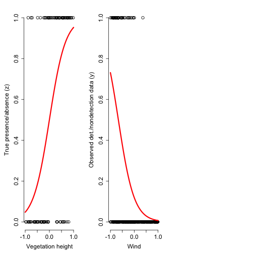

# An example occupancy model

We take our example from Applied Hierarchical Modeling in Ecology, Vol I (K&#233;ry and Royle): Chapter 10, Section 10.4.

- A simulated example
- `M` = 100 sites
- `J` = 3 visits to each site
- `vegHt` = vegetation height: logistic effect on occupancy probability
- `wind` = wind speed: logistic effect on detection probability

# Occupancy probabilities

Define `X[i, t]` = 1 if the species was detected as site `i` at time `t`, 0 otherwise.

Probability(`X[i, 1:T]`) = Probability(Site Occupied) Probability(Detections and non-detections) + Probability(Site Not Occupied) Indicator(All `X[i, t]` are 0)

# Let's see the figures from AHM book code


```r
cur_dir <- getwd()
setwd(file.path(nimble_course_dir,
                 'examples_code',
                 'occupancy_with_covariates'))
.GlobalEnv$DO_PLOT <- TRUE
source("occupancy_with_covariates.R")
```

```
## [1] "do plot"
## [1] TRUE
```

```
## List of 7
##  $ y     : int [1:100, 1:3] 0 0 0 0 0 0 0 0 1 0 ...
##  $ vegHt : num [1:100] -0.973 -0.953 -0.882 -0.876 -0.859 ...
##  $ wind  : num [1:100, 1:3] -0.465 -0.5627 0.0336 -0.4621 -0.6377 ...
##  $ M     : int 100
##  $ J     : int 3
##  $ XvegHt: num [1:100] -1 -0.98 -0.96 -0.939 -0.919 ...
##  $ Xwind : num [1:100] -1 -0.98 -0.96 -0.939 -0.919 ...
```

```r
setwd(cur_dir)
```



# BUGS code for this model

Here is the BUGS code provided by AHM.

- It may be slightly modified to work for NIMBLE.
- Derived (posterior predictive) quantities are shown here but omitted below when we run MCMC.

    - These quantities will not be available when we re-write the model.  Keeping them in the basic model would be an unfair computational cost in this comparison.


```r
Section10p4_code
```

```
## {
##     mean.p ~ dunif(0, 1)
##     alpha0 <- logit(mean.p)
##     alpha1 ~ dunif(-20, 20)
##     mean.psi ~ dunif(0, 1)
##     beta0 <- logit(mean.psi)
##     beta1 ~ dunif(-20, 20)
##     for (i in 1:M) {
##         z[i] ~ dbern(psi[i])
##         logit(psi[i]) <- beta0 + beta1 * vegHt[i]
##         for (j in 1:J) {
##             y[i, j] ~ dbern(p.eff[i, j])
##             p.eff[i, j] <- z[i] * p[i, j]
##             logit(p[i, j]) <- alpha0 + alpha1 * wind[i, j]
##         }
##     }
##     N.occ <- sum(z[1:M])
##     psi.fs <- N.occ/M
##     for (k in 1:100) {
##         logit(psi.pred[k]) <- beta0 + beta1 * XvegHt[k]
##         logit(p.pred[k]) <- alpha0 + alpha1 * Xwind[k]
##     }
## }
```

## Thinking about the graph

- There is a latent state, `z[i]` for every site.

## Version we will use

The version without derived quantities is this:

```r
Section10p4_noDerived_code
```

```
## {
##     mean.p ~ dunif(0, 1)
##     alpha0 <- logit(mean.p)
##     alpha1 ~ dunif(-20, 20)
##     mean.psi ~ dunif(0, 1)
##     beta0 <- logit(mean.psi)
##     beta1 ~ dunif(-20, 20)
##     for (i in 1:M) {
##         z[i] ~ dbern(psi[i])
##         logit(psi[i]) <- beta0 + beta1 * vegHt[i]
##         for (j in 1:J) {
##             y[i, j] ~ dbern(p.eff[i, j])
##             p.eff[i, j] <- z[i] * p[i, j]
##             logit(p[i, j]) <- alpha0 + alpha1 * wind[i, j]
##         }
##     }
## }
```

# Basic MCMC comparison


```r
params_of_interest <- c("alpha0", "alpha1", "beta0", "beta1")
## N.occ would be of interest, but we'll need to get that after
## MCMC in the next version, so we skip it here too.

ni <- 25000
nb <- 2000

occupancy_basic_comparison <- compareMCMCs(
  modelInfo = list(
    code = Section10p4_noDerived_code,
    data = occupancy_data,
    inits = occupancy_inits()
  ),
  ## making the comparison for all latent states in params
  ## would be cumbersome
  monitors = params_of_interest,
  MCMCs = c('nimble', 'jags'),
  summary = FALSE,
  burnin = nb,
  niter = ni
)
```

```
## Working on model1
```

```
## defining model...
```

```
## Detected y as data within 'constants'.
```

```
## Adding y as data for building model.
```

```
## building model...
```

```
## setting data and initial values...
```

```
## running calculate on model (any error reports that follow may simply reflect missing values in model variables) ... 
## checking model sizes and dimensions...
## model building finished.
```

```
## Warning in rjags::jags.model(file = modelFileName, data =
## constantsAndData, : Unused variable "XvegHt" in data
```

```
## Warning in rjags::jags.model(file = modelFileName, data =
## constantsAndData, : Unused variable "Xwind" in data
```

```
## Compiling model graph
##    Resolving undeclared variables
##    Allocating nodes
## Graph information:
##    Observed stochastic nodes: 300
##    Unobserved stochastic nodes: 104
##    Total graph size: 2317
## 
## Initializing model
```

```
## compiling... this may take a minute. Use 'showCompilerOutput = TRUE' to see C++ compiler details.
## compilation finished.
## compiling... this may take a minute. Use 'showCompilerOutput = TRUE' to see C++ compiler details.
## compilation finished.
```

```
## |-------------|-------------|-------------|-------------|
## |-------------------------------------------------------|
```

```r
make_MCMC_comparison_pages(occupancy_basic_comparison,
                           modelNames = "Section10p4",
                           dir = "occupancy_basic_comparison")

##browseURL(file.path(occupancy_basic_comparison, "Section10p4.html"))
```

Results are [here](occupancy_basic_comparison/Section10p4.html)

# Exercise

Rewrite this model to use a `dOccupancy` distribution for the vector `y[i, 1:J]` of observations from each size `i`.  This should allow you to remove the `z[i]` nodes from the model.  You will also need to write `dOccupancy` itself.

