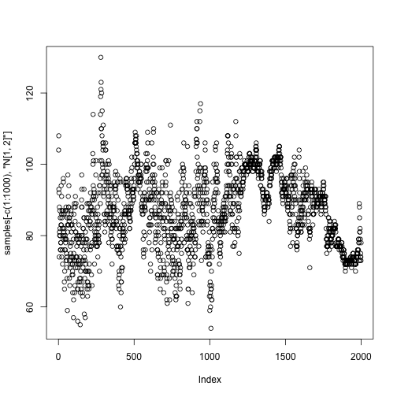
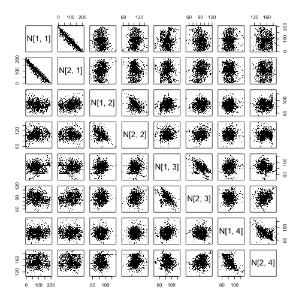
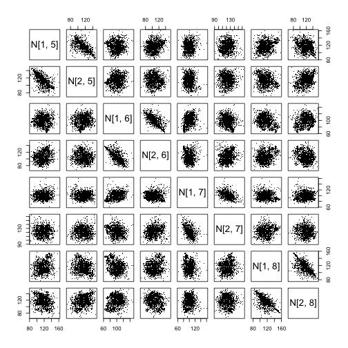
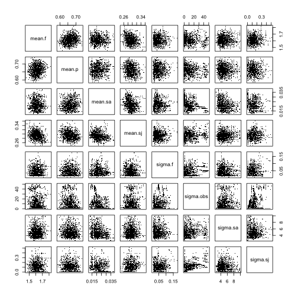

# Example: Woodchat Shrike

Thanks to Michael Schaub for this example.  (Where is it from?)

Michael's summary:

## Available data:
- marray: capture-recapture data in the marray format. It's a 3D array, the third dimension being the age (juvenile vs. adult)
- count: population counts in each year
- productivity data: vector J is the number of fledglings per year and B is the annual number of surveyed broods which give raise to the number of fledglings.

## Some features of the model:
- based on the life history of a passerine (2 age classes for survival, age at first reproduction = 1 year)
- includes demographic and environmental stochasticity (i.e temporal random effects on all demographic rates)

## Look at the data

```r
bugs.data$marr.a
```

```
##       [,1] [,2] [,3] [,4] [,5] [,6] [,7] [,8] [,9] [,10]
##  [1,]   30    2    0    1    0    0    0    0    0    34
##  [2,]    0   15    6    0    2    0    0    0    0    29
##  [3,]    0    0   23    4    0    0    0    0    0    13
##  [4,]    0    0    0   17    0    1    0    0    0    34
##  [5,]    0    0    0    0   21    4    0    0    0    31
##  [6,]    0    0    0    0    0   19    1    1    0    25
##  [7,]    0    0    0    0    0    0   18    3    1    33
##  [8,]    0    0    0    0    0    0    0   10    5    27
##  [9,]    0    0    0    0    0    0    0    0   14    25
```

```r
bugs.data$marr.j
```

```
##       [,1] [,2] [,3] [,4] [,5] [,6] [,7] [,8] [,9] [,10]
##  [1,]   22    4    1    0    0    0    0    0    0    71
##  [2,]    0   19    2    0    0    0    0    0    0    77
##  [3,]    0    0   20    7    0    0    0    1    0    75
##  [4,]    0    0    0   27    2    1    0    0    0    74
##  [5,]    0    0    0    0   21    5    0    0    0    96
##  [6,]    0    0    0    0    0   25    4    1    0    89
##  [7,]    0    0    0    0    0    0   19    3    0    81
##  [8,]    0    0    0    0    0    0    0   20    6    96
##  [9,]    0    0    0    0    0    0    0    0   23    96
```

```r
bugs.data$B
```

```
##  [1] 62 49 59 69 74 59 60 82 67 72
```

```r
bugs.data$J
```

```
##  [1]  98  95 102 106 118  98  92 128 109 108
```

# Try MCMC and study results

```r
nimbleOptions(verbose = FALSE)
## 1. Build model
ipm_model <- nimbleModel(ipm_code,
                         constants = bugs.data,
                         inits = initsVals)
## 2. Build MCMC configuration and samplers:
ipm_mcmc <- buildMCMC(ipm_model)
## 3. Compile model via generated C++.
Cipm_model <- compileNimble(ipm_model)
## 4. Compile MCMC via generated C++
Cipm_mcmc <- compileNimble(ipm_mcmc, project = ipm_model)
## 5. Run MCMC. (nimble does not natively support multiple chains.)
# MCMC settings
ni <- 3000; nt <- 1; nb <- 1000; nc <- 3
samples <- runMCMC(Cipm_mcmc, ni)
```

```
## |-------------|-------------|-------------|-------------|
## |-------------------------------------------------------|
```

```r
colnames(samples)
```

```
##  [1] "N[1, 1]"   "N[2, 1]"   "N[1, 2]"   "N[2, 2]"   "N[1, 3]"  
##  [6] "N[2, 3]"   "N[1, 4]"   "N[2, 4]"   "N[1, 5]"   "N[2, 5]"  
## [11] "N[1, 6]"   "N[2, 6]"   "N[1, 7]"   "N[2, 7]"   "N[1, 8]"  
## [16] "N[2, 8]"   "N[1, 9]"   "N[2, 9]"   "N[1, 10]"  "N[2, 10]" 
## [21] "mean.f"    "mean.p"    "mean.sa"   "mean.sj"   "sigma.f"  
## [26] "sigma.obs" "sigma.sa"  "sigma.sj"
```
## Study results

```r
## Pick a few trace plots
plot(samples[,'N[1, 1]']) ## yuck
```


```r
plot(samples[,'N[1, 2]']) ## much better
```



```r
plot(samples[,'mean.p']) ## looks pretty good
```


```r
## look at some pairs, dropped burnin = 500
pairs(samples[-(1:500), 1:8], pch = '.')
```



```r
pairs(samples[-(1:500), 9:16], pch = '.')
```



```r
## skip some
pairs(samples[-(1:500), 21:28], pch = '.') ## some parameters mixing poorly!
```



```r
## Look at ESS:
library(coda)
effectiveSize(samples)
```

```
##    N[1, 1]    N[2, 1]    N[1, 2]    N[2, 2]    N[1, 3]    N[2, 3] 
##   9.619708   4.156681 108.227309  93.336616 111.248926  68.794176 
##    N[1, 4]    N[2, 4]    N[1, 5]    N[2, 5]    N[1, 6]    N[2, 6] 
##  77.797537  64.652178  87.453276 119.710995  61.155843  52.277386 
##    N[1, 7]    N[2, 7]    N[1, 8]    N[2, 8]    N[1, 9]    N[2, 9] 
##  79.237180  55.712567  85.348799  81.725101  50.235958  41.768137 
##   N[1, 10]   N[2, 10]     mean.f     mean.p    mean.sa    mean.sj 
##  55.752390  83.491075 206.146941 385.111906  34.075145   1.660035 
##    sigma.f  sigma.obs   sigma.sa   sigma.sj 
##  66.152794  35.822687  57.008339   7.233599
```

```r
## We see horrible mixing for mean.sj and mean.f, and bad mixing for sigma.f
## Is mean.sj correlated with anything?
cor(samples)[,'mean.sj']
```

```
##      N[1, 1]      N[2, 1]      N[1, 2]      N[2, 2]      N[1, 3] 
## -0.792894916  0.797307746  0.051840939 -0.078317999  0.198153590 
##      N[2, 3]      N[1, 4]      N[2, 4]      N[1, 5]      N[2, 5] 
## -0.045514890  0.044336231 -0.076913497 -0.173884154  0.138358766 
##      N[1, 6]      N[2, 6]      N[1, 7]      N[2, 7]      N[1, 8] 
##  0.270299129 -0.226191521  0.038866010 -0.042709582  0.046789581 
##      N[2, 8]      N[1, 9]      N[2, 9]     N[1, 10]     N[2, 10] 
##  0.007659393  0.061857881  0.053933646  0.270864320 -0.264214878 
##       mean.f       mean.p      mean.sa      mean.sj      sigma.f 
##  0.086699562  0.008435381 -0.108622295  1.000000000 -0.196124623 
##    sigma.obs     sigma.sa     sigma.sj 
## -0.058595844 -0.150258487 -0.824192970
```

We see `mean.sj` is highly correlated with `mean.f`.

This makes
sense.  We might consider how to sample them jointly in a sensible
way.

But let's instead focus on the correlated adult-juvenile pairs.
Sometimes mixing one part of a model more helps other parts mix tool.

# Sample adults and juveniles jointly at each time


```r
sampler_JuvAdult <- nimbleFunction(
    name = 'sampler_JuvAdult',
    contains = sampler_BASE,
    setup = function(model, mvSaved, target, control) {
        adaptive      <- if(!is.null(control$adaptive))      control$adaptive      else TRUE
        adaptInterval <- if(!is.null(control$adaptInterval)) control$adaptInterval else 200
        scale         <- if(!is.null(control$scale))         control$scale         else 1
        constantSum   <- if(!is.null(control$constantSum))   as.integer(control$constantSum)   else 1L        
        calcNodes <- model$getDependencies(target)
        ##
        targetJuv <- target[1]
        targetAdult <- target[2]
        ## numeric value generation
        scaleOriginal <- scale
        timesRan      <- 0
        timesAccepted <- 0
        timesAdapted  <- 0
        optimalAR     <- 0.44
        gamma1        <- 0

    },
    run = function() {
        propLogScale <- 0
        propDiff <- round(rnorm(1, mean = 0, sd = scale))
        model[[targetJuv]] <<- model[[targetJuv]] + propDiff
        model[[targetAdult]] <<- model[[targetAdult]] - constantSum * propDiff
        logMHR <- calculateDiff(model, calcNodes)
        jump <- decide(logMHR)
        if(jump) nimCopy(from = model, to = mvSaved, row = 1, nodes = calcNodes, logProb = TRUE)
        else     nimCopy(from = mvSaved, to = model, row = 1, nodes = calcNodes, logProb = TRUE)
        if(adaptive)     adaptiveProcedure(jump)
    },
    methods = list(
        adaptiveProcedure = function(jump = logical()) {
            timesRan <<- timesRan + 1
            if(jump)     timesAccepted <<- timesAccepted + 1
            if(timesRan %% adaptInterval == 0) {
                acceptanceRate <- timesAccepted / timesRan
                timesAdapted <<- timesAdapted + 1
                gamma1 <<- 1/((timesAdapted + 3)^0.8)
                gamma2 <- 10 * gamma1
                adaptFactor <- exp(gamma2 * (acceptanceRate - optimalAR))
                scale <<- scale * adaptFactor
                timesRan <<- 0
                timesAccepted <<- 0
            }
        },
        reset = function() {
            scale <<- scaleOriginal
            timesRan      <<- 0
            timesAccepted <<- 0
            timesAdapted  <<- 0
            gamma1 <<- 0
        }
    ), where = getLoadingNamespace()
)

configureMCMC_IPM <- function(model) {
    mcmcConf <- configureMCMC(model)
    mcmcConf$removeSamplers('N')
    Nnodes <- model$expandNodeNames('N')
    for(i in seq(1, length(Nnodes), by = 2)) {
        JuvAdultPair <- Nnodes[i:(i+1)]## e.g. c('N[1, 1]', 'N[2, 1]')
        mcmcConf$addSampler(JuvAdultPair,
                            type = sampler_JuvAdult)
        mcmcConf$addSampler(JuvAdultPair,
                            type = sampler_JuvAdult,
                            control = list(constantSum = FALSE))
    }
    mcmcConf
}
```

# Let's compare performance

```r
configureMCMC_IPM <- function(model) {
    mcmcConf <- configureMCMC(model)
    mcmcConf$removeSamplers('N')
    Nnodes <- model$expandNodeNames('N')
    for(i in seq(1, length(Nnodes), by = 2)) {
        JuvAdultPair <- Nnodes[i:(i+1)]## e.g. c('N[1, 1]', 'N[2, 1]')
        mcmcConf$addSampler(JuvAdultPair,
                            type = sampler_JuvAdult)
        mcmcConf$addSampler(JuvAdultPair,
                            type = sampler_JuvAdult,
                            control = list(constantSum = FALSE))
    }
    mcmcConf
}

ipm_comparison <- compareMCMCs(
    list(code = ipm_code,
         inits = initsVals,
         data = bugs.data),
    MCMCs = c('nimble','jags','nimbleCustom'),
    MCMCdefs = list(nimbleCustom = quote({
        configureMCMC_IPM(Rmodel)
    })),
    summary = FALSE,
    burnin = 5000,
    niter = 20000,
    monitors = parameters)

make_MCMC_comparison_pages(ipm_comparison,
                           dir = "ipm_comparison",
                           modelNames = "woodshrike")

##browseURL(file.path("ipm_comparison","woodshrike.html"))
```

Results are [here](ipm_comparisons/woodshrike.html)
