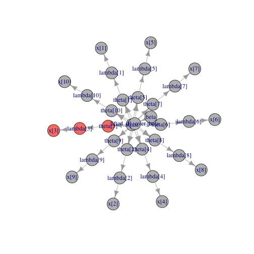
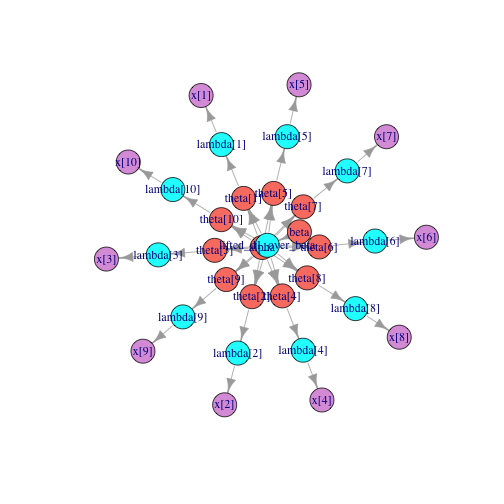
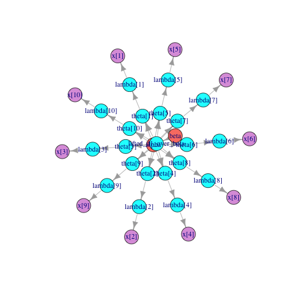
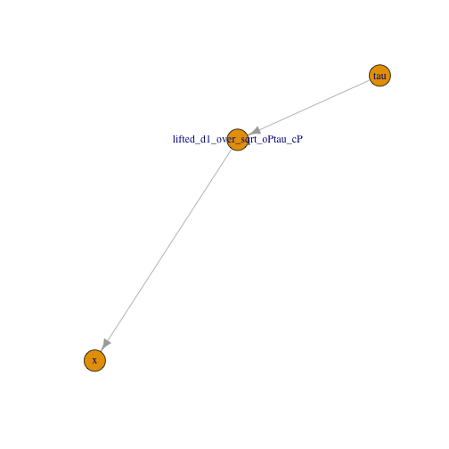
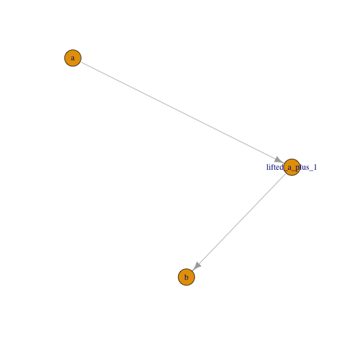

# Outline

In this module, we'll learn some terms and concepts for models in NIMBLE:

- the distinction between a *variable* and a *node*;
- how to find variables and nodes in a model;
- some different types of nodes;
- what *lifted nodes* are;
- an introduction to *model-generic programming*.

We will continue to use the pump model to illustrate concepts because it is so simple.

# Pump model


```r
pumpCode
```

```
## {
##     for (i in 1:N) {
##         x[i] ~ dpois(lambda[i])
##         lambda[i] <- theta[i] * t[i]
##         theta[i] ~ dgamma(alpha, beta)
##     }
##     alpha ~ dexp(1)
##     beta ~ dgamma(0.1, 1)
## }
```

# Variables and Nodes

- A **variable** is an object that contains one or more nodes.
- A **node** is an object declared in a model statement.
- Every node is *stochastic* (declared with `~`) or * deterministic (declared with `<-`).

Example:

- `lambda` is a variable in the pump model.
- `lambda[3]` is a node in the pump model.

A node can be scalar or multivariate.

One of the main features of the BUGS language is that a variable can contain a variety of different kinds of nodes.

Example:

- We could have a variable `X` that is 10 $\times$ 10.
- `X[1:10, 1]` could be a stochastic node following a Dirichlet distribution.
- Each `X[1, 2:5]`...`X[10, 2:5]` could be a vector deterministic node from some calculation.
- Each `X[1,6]`...`X[9, 10]` could be a scalar stochastic node following a gamma distribution.
- `X[10, 6:10]` could be a stochastic node following a multivariate normal.

# Accessing values of variables and nodes

### Accessing variables


```r
pump$lambda ## accesses the variable lambda
```

```
##  [1]  9.430  1.570  6.290 12.600  0.524  3.140  0.105  0.105  0.210  1.050
```

```r
pump$lambda[3:5] ## accesses elements of lambda
```

```
## [1]  6.290 12.600  0.524
```

```r
## which may or may not be one node or multiple nodes.
```

### Accessing nodes

```r
pump[['lambda[3]']] ## accesses node lambda[3]
```

```
## [1] 6.29
```

You can also assign values (`<-`) to variables and nodes.

Example: If you didn't provide a good choice of initial values when you created the model (via `inits` argument to `nimbleModel`), you are free to assign values to the model via its variables or nodes.

# Why does accessing nodes seem strange in R?

- `pump$lambda[3]` feels "natural" in R.
- `pump[['lambda[3]']]` feels "strange" in R.

    - Why?  The index is in a character string!
    - `pump[['lambda[i]']]` **does not work**. `i` will not be evaluated
    - `pump$lambda[i]` will of course work.

The reason for the node name system is model-generic programming.

- Sometimes a node will be `X[2, 3]` or `beta[4, 6, 1]`.
- These are all scalar nodes.
- We need a way to use nodes that does not depend on how many indices they have. Hence we use node names.
- We will see this more concretely later.

# Learning about the variable and nodes in your model.

We can see all the node names like this:

```r
pump$getNodeNames()
```

```
##  [1] "alpha"               "beta"                "lifted_d1_over_beta"
##  [4] "theta[1]"            "theta[2]"            "theta[3]"           
##  [7] "theta[4]"            "theta[5]"            "theta[6]"           
## [10] "theta[7]"            "theta[8]"            "theta[9]"           
## [13] "theta[10]"           "lambda[1]"           "lambda[2]"          
## [16] "lambda[3]"           "lambda[4]"           "lambda[5]"          
## [19] "lambda[6]"           "lambda[7]"           "lambda[8]"          
## [22] "lambda[9]"           "lambda[10]"          "x[1]"               
## [25] "x[2]"                "x[3]"                "x[4]"               
## [28] "x[5]"                "x[6]"                "x[7]"               
## [31] "x[8]"                "x[9]"                "x[10]"
```

We can see just the node names from one variable or part of a variable like this:

```r
pump$expandNodeNames('lambda')
```

```
##  [1] "lambda[1]"  "lambda[2]"  "lambda[3]"  "lambda[4]"  "lambda[5]" 
##  [6] "lambda[6]"  "lambda[7]"  "lambda[8]"  "lambda[9]"  "lambda[10]"
```

```r
pump$expandNodeNames('lambda[2:5]')
```

```
## [1] "lambda[2]" "lambda[3]" "lambda[4]" "lambda[5]"
```

We can see variable names like this:

```r
pump$getVarNames()
```

```
## [1] "x"                   "lambda"              "lifted_d1_over_beta"
## [4] "theta"               "alpha"               "beta"
```

We can get information about a variable like this:

```r
pump$getVarInfo('lambda')
```

```
## Reference class object of class "varInfoClass"
## Field "varName":
## [1] "lambda"
## Field "mins":
## [1] 1
## Field "maxs":
## [1] 10
## Field "nDim":
## [1] 1
## Field "anyStoch":
## [1] FALSE
## Field "anyDynamicallyIndexed":
## [1] FALSE
```

```r
pump$getVarInfo('theta')
```

```
## Reference class object of class "varInfoClass"
## Field "varName":
## [1] "theta"
## Field "mins":
## [1] 1
## Field "maxs":
## [1] 10
## Field "nDim":
## [1] 1
## Field "anyStoch":
## [1] TRUE
## Field "anyDynamicallyIndexed":
## [1] FALSE
```

# logProb variables

Every stochastic node automatically has an element of a "logProb" variable associated
with it. The log probability (density) of the variable will be stored in this element when it is *calculated*.

logProb variables are simply named as `logProb_[variable name]`.

We sometimes call these "logProb nodes" out of habit, but they are not
nodes in the graph.

Example:

```r
pump$logProb_theta ## These were all initialized with the same value
```

```
##  [1] -0.1 -0.1 -0.1 -0.1 -0.1 -0.1 -0.1 -0.1 -0.1 -0.1
```

```r
pump$logProb_x
```

```
##  [1]  -2.998011  -1.118924  -1.882686  -2.319466  -4.254550 -20.739651
##  [7]  -2.358795  -2.358795  -9.630645 -48.447798
```

You don't generally need to use logProb variables directly.  Once we start
programming, you will instead use

```r
pump$getLogProb('x[3]')
```

```
## [1] -1.882686
```
However it is useful to understand the existence of the logProb variables.


# Finding logProb variables

### Scalar nodes
For scalar stochastic nodes, the logProb node is usually obvious.

For `theta[3]`, the log probability value will be in
`logProb_theta[3]`.

### Multivariate nodes
For multivariate stochastic nodes, it is not as obvious.

If `X[3:5,  2]` follows a multivariate normal, its log probability
value will be in `logProb_X[3, 2]`.

You can find logProb variables like this:

```r
pump$getVarNames(includeLogProb = TRUE)
```

```
##  [1] "x"                   "lambda"              "lifted_d1_over_beta"
##  [4] "theta"               "alpha"               "beta"               
##  [7] "logProb_x"           "logProb_theta"       "logProb_alpha"      
## [10] "logProb_beta"
```

# Topological ordering of nodes and why it matters

Suppose we want to change the value of `theta[3]` and update all relevant
parts of the graph.

(The meaning of "relevant" depends on our purpose of changing `theta[3]`.
In this case imagine we are making a Metropolis-Hastings (MCMC)
proposal and need to calculate its acceptance probability.)

The nodes that need to be updated are shown in red.


```r
## function drawGraph is defined in the R file for this module
drawGraph(pump, colorBy = pump$getDependencies('theta[3]'))
```



Note that **order matters**.  If we calculated the log probability
density of `x[3]` *before* calculating `lambda[3]`, then `x[3]` would
use the *old* value of `lambda[3]`.  That would be a mistake.

A valid order for calculations is called **topologically sorted**.  Most
of NIMBLE's model-querying functions will return nodes in tologically sorted order.

# Types of nodes.

Some definitions:

- LHS = "left-hand-side" of a BUGS declaration
- RHS = "right-hand-side" of a BUGS declaration

Every node falls into one of following categories **based on
how it appears in BUGS code**:

- deterministic: declared on LHS  with `<-`
- stochastic: declared on LHS with `~`
- RHSonly: appears only on RHS of one or more declarations, never on
the LHS.

Every node *also* falls into one of the following categories **based on where
it is in the graph**:

- top: Has no stochastic nodes "above" it in the graph.
- latent: Has stochastic nodes "above" and "below" it in the graph.
- end: Has no stochastic nodes "below" it in the graph.

Sometimes people use ancestray terms:

- "above" = "parent" or "ancestor"
- "below" = "child" or "descendent"

Once a model is created, stochastic nodes can be labeled as **data**.

- Multiple copies of the same model can be created from the same BUGS code, with
possibly different data nodes.
- The data label is used by programs to decide what to do.
- Values of data nodes can be changed.
- Data labels should not be changed after an algorithm like MCMC
  has been built for a model.

# Finding out about nodes

## Stochastic, deterministic, and/or data
Here is a graph color-coded by whether nodes are stochastic,
deterministic, and/or labeled as data:


```r
drawGraph(pump, colorBy = "stochDetermData")
```



You can select groups of nodes by these types:


```r
## deterministic nodes
pump$getNodeNames(determOnly = TRUE)
```

```
##  [1] "lifted_d1_over_beta" "lambda[1]"           "lambda[2]"          
##  [4] "lambda[3]"           "lambda[4]"           "lambda[5]"          
##  [7] "lambda[6]"           "lambda[7]"           "lambda[8]"          
## [10] "lambda[9]"           "lambda[10]"
```

```r
## all stochastic nodes
pump$getNodeNames(stochOnly = TRUE, includeData = TRUE)
```

```
##  [1] "alpha"     "beta"      "theta[1]"  "theta[2]"  "theta[3]" 
##  [6] "theta[4]"  "theta[5]"  "theta[6]"  "theta[7]"  "theta[8]" 
## [11] "theta[9]"  "theta[10]" "x[1]"      "x[2]"      "x[3]"     
## [16] "x[4]"      "x[5]"      "x[6]"      "x[7]"      "x[8]"     
## [21] "x[9]"      "x[10]"
```

```r
## non-data stochastic nodes
pump$getNodeNames(stochOnly = TRUE, includeData = FALSE)
```

```
##  [1] "alpha"     "beta"      "theta[1]"  "theta[2]"  "theta[3]" 
##  [6] "theta[4]"  "theta[5]"  "theta[6]"  "theta[7]"  "theta[8]" 
## [11] "theta[9]"  "theta[10]"
```

## top, latend, and end

Here is a graph color-coded by whether nodes are top, latent, or end
nodes.

```r
drawGraph(pump, 'topLatentEnd')
```



You can also select groups of nodes by these types:


```r
pump$getNodeNames(topOnly = TRUE)   #salmon
```

```
## [1] "alpha" "beta"
```

```r
pump$getNodeNames(latentOnly = TRUE)  #cyan
```

```
##  [1] "lifted_d1_over_beta" "theta[1]"            "theta[2]"           
##  [4] "theta[3]"            "theta[4]"            "theta[5]"           
##  [7] "theta[6]"            "theta[7]"            "theta[8]"           
## [10] "theta[9]"            "theta[10]"           "lambda[1]"          
## [13] "lambda[2]"           "lambda[3]"           "lambda[4]"          
## [16] "lambda[5]"           "lambda[6]"           "lambda[7]"          
## [19] "lambda[8]"           "lambda[9]"           "lambda[10]"
```

```r
pump$getNodeNames(endOnly = TRUE)    #plum
```

```
##  [1] "x[1]"  "x[2]"  "x[3]"  "x[4]"  "x[5]"  "x[6]"  "x[7]"  "x[8]" 
##  [9] "x[9]"  "x[10]"
```

## Combined categories

Say you want to know what the stochastic, latent nodes are.


```r
pump$getNodeNames(stochOnly = TRUE, latentOnly = TRUE)
```

```
##  [1] "theta[1]"  "theta[2]"  "theta[3]"  "theta[4]"  "theta[5]" 
##  [6] "theta[6]"  "theta[7]"  "theta[8]"  "theta[9]"  "theta[10]"
```

## RHSonly nodes

You also can query the model for RHSonly nodes:

```r
pump$getNodeNames(includeRHSonly = TRUE)
```

```
##  [1] "alpha"               "beta"                "lifted_d1_over_beta"
##  [4] "theta[1]"            "theta[2]"            "theta[3]"           
##  [7] "theta[4]"            "theta[5]"            "theta[6]"           
## [10] "theta[7]"            "theta[8]"            "theta[9]"           
## [13] "theta[10]"           "lambda[1]"           "lambda[2]"          
## [16] "lambda[3]"           "lambda[4]"           "lambda[5]"          
## [19] "lambda[6]"           "lambda[7]"           "lambda[8]"          
## [22] "lambda[9]"           "lambda[10]"          "x[1]"               
## [25] "x[2]"                "x[3]"                "x[4]"               
## [28] "x[5]"                "x[6]"                "x[7]"               
## [31] "x[8]"                "x[9]"                "x[10]"
```

In this case, there are no RHSonly nodes.  We might think `t` nodes
are RHSonly, but in fact since `t` was provided in `constants`, it is
no longer considered to be a variable in the model.  Its values have been **permanently** substituted where needed.

We could modify how we create the model as follows to see `t` nodes appear as
RHSonly.


```r
## Move "t" from constants to data
pumpData2 <- c(pumpData, pumpConsts['t'])
pumpConsts2 <- pumpConsts['N']
pump2 <- nimbleModel(
    pumpCode,
    data = pumpData2,
    constants = pumpConsts2
)
```

```
## defining model...
```

```
## building model...
```

```
## setting data and initial values...
```

```
## running calculate on model (any error reports that follow may simply reflect missing values in model variables) ... 
## checking model sizes and dimensions... This model is not fully initialized. This is not an error. To see which variables are not initialized, use model$initializeInfo(). For more information on model initialization, see help(modelInitialization).
## model building finished.
```

```r
pump2$getNodeNames()
```

```
##  [1] "alpha"               "beta"                "lifted_d1_over_beta"
##  [4] "theta[1]"            "theta[2]"            "theta[3]"           
##  [7] "theta[4]"            "theta[5]"            "theta[6]"           
## [10] "theta[7]"            "theta[8]"            "theta[9]"           
## [13] "theta[10]"           "lambda[1]"           "lambda[2]"          
## [16] "lambda[3]"           "lambda[4]"           "lambda[5]"          
## [19] "lambda[6]"           "lambda[7]"           "lambda[8]"          
## [22] "lambda[9]"           "lambda[10]"          "x[1]"               
## [25] "x[2]"                "x[3]"                "x[4]"               
## [28] "x[5]"                "x[6]"                "x[7]"               
## [31] "x[8]"                "x[9]"                "x[10]"
```

```r
pump2$getNodeNames(includeRHSonly = TRUE)
```

```
##  [1] "alpha"               "beta"                "t[1]"               
##  [4] "t[2]"                "t[3]"                "t[4]"               
##  [7] "t[5]"                "t[6]"                "t[7]"               
## [10] "t[8]"                "t[9]"                "t[10]"              
## [13] "lifted_d1_over_beta" "theta[1]"            "theta[2]"           
## [16] "theta[3]"            "theta[4]"            "theta[5]"           
## [19] "theta[6]"            "theta[7]"            "theta[8]"           
## [22] "theta[9]"            "theta[10]"           "lambda[1]"          
## [25] "lambda[2]"           "lambda[3]"           "lambda[4]"          
## [28] "lambda[5]"           "lambda[6]"           "lambda[7]"          
## [31] "lambda[8]"           "lambda[9]"           "lambda[10]"         
## [34] "x[1]"                "x[2]"                "x[3]"               
## [37] "x[4]"                "x[5]"                "x[6]"               
## [40] "x[7]"                "x[8]"                "x[9]"               
## [43] "x[10]"
```

Now we see that `t` nodes have appeared when we ask to include `RHSonly` nodes.

# Topologically sorting nodes

If for some reason you have a collection of node names and need them
topologically sorted:


```r
pump$topologicallySortNodes(c('x[1:3]','beta','theta[1:3]'))
```

```
## [1] "beta"     "theta[1]" "theta[2]" "theta[3]" "x[1]"     "x[2]"    
## [7] "x[3]"
```

Often there is more than one valid topological sorting, but NIMBLE
chooses one that is usually intuitive and uses it for your model.

# Inspecting the model: Querying graph dependencies

There are several kinds of dependencies that may be needed in different circumstances.

- *Stochastic dependencies* (called the *Markov blanket* in
     computer science) terminate at stochastic nodes
     (inclusive). These are the dependencies needed for many kinds of MCMC samplers.


```r
pump$getDependencies('theta[3]')
```

```
## [1] "theta[3]"  "lambda[3]" "x[3]"
```

- *Deterministic dependencies* terminate at stochastic nodes but
omit the stochastic nodes. These can be useful for implementing a particle filter.

```r
pump$getDependencies('theta[3]', determOnly = TRUE)
```

```
## [1] "lambda[3]"
```


- Other ways to control the dependency query can be found by

```r
args(pump$getDependencies)
```

```
## function (nodes, omit = character(), self = TRUE, determOnly = FALSE, 
##     stochOnly = FALSE, includeData = TRUE, dataOnly = FALSE, 
##     includeRHSonly = FALSE, downstream = FALSE, returnType = "names", 
##     returnScalarComponents = FALSE) 
## NULL
```

```r
## or help(modelBaseClass)
```


# The importance of querying a model: lifted nodes

**You should never assume you know what nodes are in a model simply
because you wrote the BUGS code.**

NIMBLE implements some features by inserting its own nodes.  These are
called **lifted nodes**.

Let's look at the two main ways this happens:


```r
m1 <- nimbleModel(
    nimbleCode({
        tau ~ dunif(0, 100)
        x ~ dnorm(0, tau) #by default, tau is a precision
    }))
```

```
## defining model...
```

```
## building model...
```

```
## running calculate on model (any error reports that follow may simply reflect missing values in model variables) ... 
## checking model sizes and dimensions... This model is not fully initialized. This is not an error. To see which variables are not initialized, use model$initializeInfo(). For more information on model initialization, see help(modelInitialization).
## model building finished.
```

```r
plot(m1$getGraph())
```



```r
m1$getNodeNames()
```

```
## [1] "tau"                          "lifted_d1_over_sqrt_oPtau_cP"
## [3] "x"
```
The node `lifted_d1_over_sqrt_oPtau_cP` has been inserted between
`tau` and `x`.   The resulting model would equivalently have been
created by this BUGS code:


```r
nimbleCode({
    tau ~ dunif(0, 100)
    lifted_d1_over_sqrt_oPtau_cP <- 1/sqrt(tau)
    x ~ dnorm(0, sd = lifted_d1_over_sqrt_oPtau_cP) #by default, tau is a precision
}))
```

NIMBLE has *lifted* the calculation of standard deviation from
precision so that it is part of the model's graph.  Therefore *you
will make a mistake if you assume that the dependencies of `tau`
include only `x`*:


```r
m1$calculate(c('tau','x')) ## Wrong: the lifted node is being neglected
```

The correct way to do this is with model-generic programming:

```r
m1$calculate( m1$getDependencies('tau') )
```

The second common situation that creates lifted nodes is:

```r
m2 <- nimbleModel(
    nimbleCode({
        a ~ dnorm(0, 1)
        b ~ dnorm(a + 1, 1)
    }))
```

```
## defining model...
```

```
## building model...
```

```
## running calculate on model (any error reports that follow may simply reflect missing values in model variables) ... 
## checking model sizes and dimensions... This model is not fully initialized. This is not an error. To see which variables are not initialized, use model$initializeInfo(). For more information on model initialization, see help(modelInitialization).
## model building finished.
```

```r
plot(m2$getGraph())
```



```r
m2$getNodeNames()
```

```
## [1] "a"               "lifted_a_plus_1" "b"
```

In this case, NIMBLE lifted the expression `a+1` and created a node
for it.   Again the correct way to program is to query a model to
learn about its nodes.  Do not assume you know what the nodes are.

